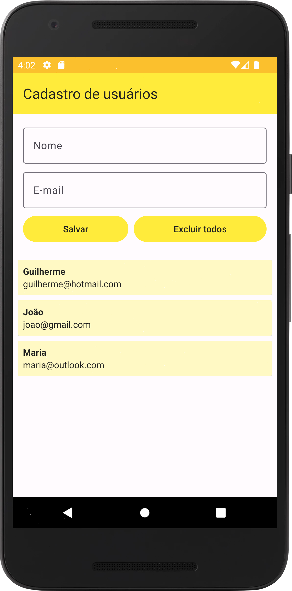
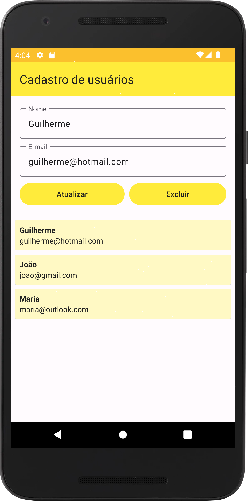
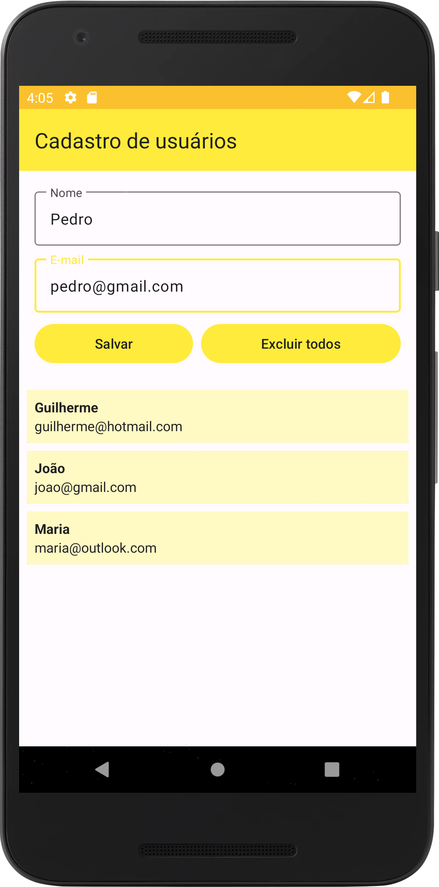

# room-demo-user-form

Um cadastro de usuários que salva os dados localmente.

Autor: Guilherme Reis - [LinkedIn](https://www.linkedin.com/in/guilhermereisdev/)

### Recursos do app
- Cria, altera, deleta e exibe usuários cadastrados com nome e e-mail.

### Técnicas utilizadas
- Room para manipular os dados no banco de dados local.
- Coroutines para executar solicitações em threads separadas.
- ViewModel
- LiveData

------

### Telas

    